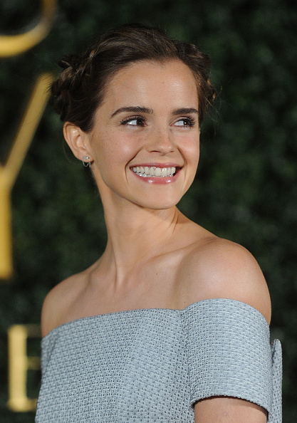

 
```{r setup, include=FALSE}
knitr::opts_chunk$set(echo = TRUE)
```
 
```{r load_code, WARNINGS=FALSE, include=FALSE}
library(tidyverse, warn.conflicts = F)
library(rvest)
library(plotly)
library(cluster)
library(ggdendro)
theme_set(theme_light())
plota_hclusts_2d = function(agrupamento,
                            dados_filme,
                            nome_colunas, # coluna usada para distâncias
                            dist_method = "euclidean", 
                            linkage_method = "complete",
                            ks = 1:9){
  #' Retorna um ggplot das soluções de agrupamento de `dados_filme` 
  #' para as quantidades de grupos em `ks` usando `hclust`.
  library(ggplot2)
  library(dplyr, warn.conflicts = F)
  
  atribuicoes = tibble(k = ks) %>% 
    group_by(k) %>% 
    do(cbind(filmes, 
             grupo = as.character(cutree(agrupamento, .$k)))) 
  
  atribuicoes %>% 
    ggplot(aes_string(x = nome_colunas[1], y = nome_colunas[2], colour = "grupo")) + 
    geom_jitter(width = .02, height = 0, size = 2, alpha = .6) +
    facet_wrap(~ paste(k, " grupos")) + 
    xlab("") %>% 
    return()
}
```
 
# Tipos de filme de Emma Watson

 
Emma Watson, aka Hermione Granger, e está se tornando uma atriz de peso em Hollywood. Diferente de muitos atores mirins ela vem, na fase adulta, alcançando bastante espaço na indústria cinematográfica. Seus projetos fora da tela do cinema, como o [HeForShe](http://www.heforshe.org/en), demonstram que ela não tem medo de se posicionar de acordo com suas opiniões. Será que essa força de vontade também se reflete nos papéis que ela escolhe retratar, são eles pouco populares?
 
Nessa análise se utilizam dados do [Rotten Tomatoes](https://www.rottentomatoes.com) sobre os filmes de Emma Watson para encontrar grupos de filmes que tenham características semelhantes. Com relação a renda e nota atribuída pelos usuários do site.
 
```{r}
from_page <- read_html("https://www.rottentomatoes.com/celebrity/emma_watson/") %>% 
    html_node("#filmographyTbl") %>% 
    html_table(fill=TRUE) %>%
    as.tibble()
 
filmes = from_page %>% 
    filter(RATING != "No Score Yet", 
           `BOX OFFICE` != "—", 
           CREDIT != "Executive Producer") %>%
    mutate(RATING = as.numeric(gsub("%", "", RATING)), 
           `BOX OFFICE` = as.numeric(gsub("[$|M]", "", `BOX OFFICE`))) %>% 
    filter(`BOX OFFICE` >= 1) 
```
 
## Observando as variáveis separadamente
 
Uma boa forma de entender os dados com os quais se está lidando é ve-los através de alguma visualização sumarizada. Os scatterplots abaixo representam os números de renda e notas do RottenTomatoes dos filmes.
 
###  Rating atribuído no Rotten Tomatoes
 
```{r}
filmes %>% 
    ggplot(aes(x = "Filmes", y = RATING)) + theme_bw() +
    geom_jitter(width = .01, height = 0, size = 2.5, alpha = .6, color="navy") +
    labs(title="Rating dos filmes", x="", y="Rating (%)")
```
 
Num primeiro olhar, se pode perceber pelo menos dois grupos formados pelos filmes, um sendo composto exclusivamente pelo filme com rating mais baixo, [The Circle](https://www.rottentomatoes.com/m/the_circle_2017) de 2017.
 
### Box Office (Renda) 
 
Os valores de box office variam em intervalos maiores que os ratings dos filmes, por isso é interessante usar algum tipo de escala para normalizar os dados. Para que valores muito distintos não se sobressaiam e atrapalhem a definição dos grupos.
 
```{r}
filmes %>% 
    ggplot(aes(x = "Filmes", y = `BOX OFFICE`)) + 
    geom_jitter(width = .02, height = 0, size = 2.5, alpha = .6, color="chartreuse3") +
    labs(title="Box Office dos filmes (sem normalização)", x="", y="Renda (Milhões de dólares)")
```
 
A normalização utilizada distribui a distância entre os pontos de acordo com o quanto essa distância representa para a posição do ponto em questão. Por exemplo, a "distância" de 1 milhão de dólares significa mais para filmes que tiveram rendimento menor que 5 milhões do que para filmes que tiveram rendimento maior de 100 milhões.
 
```{r, message=FALSE, warning=FALSE, echo=FALSE}
filmes %>% 
    ggplot(aes(x = "Filmes", y = `BOX OFFICE`)) + 
    geom_jitter(width = .02, height = 0, size = 2.5, alpha = .6, color="chartreuse4") +
    scale_y_log10() +
    labs(title="Box Office dos filmes (com normalização)", x="", y="Renda (Milhões de dólares)")
```
 
Observando os dois gráficos se pode distinguir três ou mais grupos. O filme The Circle, que teve a menor nota no Rotten Tomatoes, pertence a massa de pontos localizada no início do eixo y, os filmes com os menores box offices. Isso pode ser um indício de que no conjunto de filmes de Emma Watson os filmes com menores notas no Rotten Tomatoes também tiverem pior rendimento de público, para validar ou invalidar essa suposição se utilizam técnicas de agrupamento.
 
## Agrupando as variáveis individualmente
 
O processo de agrupamento consiste em definir o que se considera distância entre pontos e grupos e aplicar essa definição para separar os pontos em grupos. Depois disso se avalia se os grupos formados são realmente semelhantes e representam grupos distintos e significativos dentro do conjunto.
 
Para agrupar as variáveis individualmente se utilizará o dendograma, um diagrama de árvore que relaciona grupos hierarquicamente com arestas e nós.
 
### Rating atribuído no RottenTomatoes
 
O diagrama mostra as similaridades dos filmes baseando-se na nota que eles receberam no Rotten Tomatoes, quanto mais comprida é a ligação entre dois grupos mais diferentes os são grupos. A linha é uma sugestão de onde deveria haver a separação de grupos. Nesse caso é sugerido que se tenha três grupos distintos.
 
```{r, message=FALSE, warning=FALSE}
row.names(filmes) = NULL
agrupamento_h = filmes %>% 
    column_to_rownames("TITLE") %>%
    select(RATING) %>%
    dist(method = "euclidian") %>% 
    hclust(method = "ward.D")
 
ggdendrogram(agrupamento_h, rotate = T, size = 2) + 
    geom_hline(yintercept = 45, color="navy")
```
 
Quando se juntam dois grupos muito diferentes o comprimento da junção aumenta muito, por isso é comum se separar os grupos na junção que começa a ter um comprimento muito maior que as anteriores. Se pode ver no gráfico abaixo que esse "salto" no comprimento acontece quando se tem três grupos. 
 
```{r}
data.frame(k = 1:NROW(agrupamento_h$height), 
           height = agrupamento_h$height) %>% 
    ggplot(aes(x = k, y = height)) + 
    geom_line(colour = "navy", alpha=.5) + 
    geom_point(colour = "navy") + 
    labs(x = "Junções feitas (15 - grupos)", y = "Diferença na junção", title="Rating")
```
 
### Box Office
 
Quando se analisa o Box Office tem-se três grupos distintos e diferentes dos três grupos formados no agrupamento por rating.
 
```{r, message=FALSE, warning=FALSE}
row.names(filmes) = NULL
agrupamento_h_bo = filmes %>% 
    column_to_rownames("TITLE") %>%
    select(`BOX OFFICE`) %>%
    dist(method = "euclidian") %>% 
    hclust(method = "ward.D")
 
ggdendrogram(agrupamento_h_bo, rotate = T, size = 2) + 
    geom_hline(yintercept = 250, color="chartreuse4")
```
 
Novamente, quanto se tem três grupos tem-se também um "salto" nas diferenças entre grupos.
 
```{r}
data.frame(k = 1:NROW(agrupamento_h$height), 
           height = agrupamento_h$height) %>% 
    ggplot(aes(x = k, y = height)) + 
    geom_line(colour = "chartreuse4", alpha=.5) + 
    geom_point(colour = "chartreuse4") + 
    labs(x = "Junções feitas (15 - grupos)", y = "Diferença na junção", title="Box Office")
 
```
 
## Agrupamento com 2 variáveis
 
Agora, finalmente, serão utilizadas duas variáveis para agrupar os filmes. É importante notar, de novo, que o intervalo de valores de Box Office é bem maior que o de Rating. Isso faz com que box office tenha um peso muito maior no agrupamento, por isso é preciso padronizar os valores. 
 
```{r, message=FALSE, warning=FALSE}
agrupamento_h_2d = filmes %>% 
    column_to_rownames("TITLE") %>%
    select(RATING, `BOX OFFICE`) %>% 
    mutate(`BOX OFFICE` = log10(`BOX OFFICE`)) %>% 
    mutate_all(funs(scale)) %>% 
    dist(method = "euclidean") %>% 
    hclust(method = "centroid")
 
ggdendrogram(agrupamento_h_2d, rotate = TRUE) + 
    geom_hline(yintercept = 1, color="orangered1")
```
 
Ao observar o dendograma vê-se que as distâncias entre os grupos começam a aumentar muito quando se tem 5 grupos. Plotando a organização padronizada de 1 a 6 grupos também se percebe que existem 5 ou mais grupos bem distintos. O método escolhido para calcular a distância entre pontos e grupos foi o método centróide, que vê distância como a diferença entre o centros dos grupos, juntando os grupos com a menor diferença entre seus centros.
 
```{r, message=FALSE, warning=FALSE}
filmes2 = filmes %>% mutate(`BOX OFFICE` = log10(`BOX OFFICE`))
plota_hclusts_2d(agrupamento_h_2d, 
                 filmes2, 
                 c("RATING", "`BOX OFFICE`", "TITLE"), 
                 linkage_method = "centroid", ks = 1:6) + scale_y_log10()
```
 
## Agrupamento escolhido
 
O agrupamento escolhido foi aquele com 5 grupos distintos, mesmo que alguns grupos tenham poucos pontos esse agrupamento parece separar bem os filmes.
 
```{r, message=FALSE, warning=FALSE, echo=FALSE, error=FALSE}
atribuicoes = tibble(k = 5) %>% 
    group_by(k) %>% 
    do(cbind(filmes, 
             Grupo = as.character(cutree(agrupamento_h_2d, .$k)))) 
 
result = atribuicoes %>% 
  ggplot(aes_string(x = "RATING", y = "`BOX OFFICE`", colour = "Grupo")) + 
  geom_jitter(aes(text=paste('Filme:', TITLE)), 
             width =.52, height = 0, size = 2, alpha = .6) +
  xlab("")  + scale_y_log10()
 
ggplotly(result, tootip=c("text"))
```
 
O grupo 1 pode ser chamado de __Desagradáveis__ porque tiveram ratings muito baixos e um box office baixo também, esse grupo é composto pelo filme já mencionado The Circle que desagradou público *&* crítica. Já o grupo 2 representa os __Blockbusters__ filmes como os da franquia Harry Potter que tem muitos fãs e são um sucesso de bilheteria. O grupo 3, __Nicho__, teve a menor renda entre os grupos e o rating mediano, é composto pelo filme The Bling Ring, de Sofia Coppola, que agrada um tipo específico de crítica mas, aparentemente, não leva o público ao cinema. O grupo 4 teve ratings muito boas mas resultado menos rentável, é composto por filmes ditos __Alternativos__ como As Vantagens de Ser Invisível. E o grupo 5 aparenta ser um ponto médio entre os filmes, tanto seu box office quando rating estão no centro dos outro grupos, é composto pelo filme As aventuras do Ratinho Despereaux, um filme de animação para crianças e será chamado de __Animados__.
 
 
